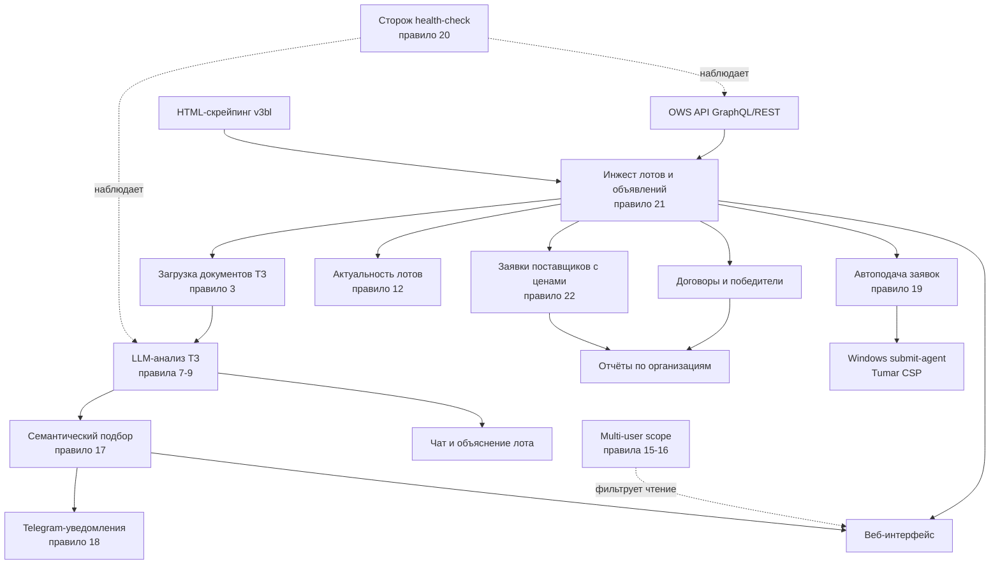
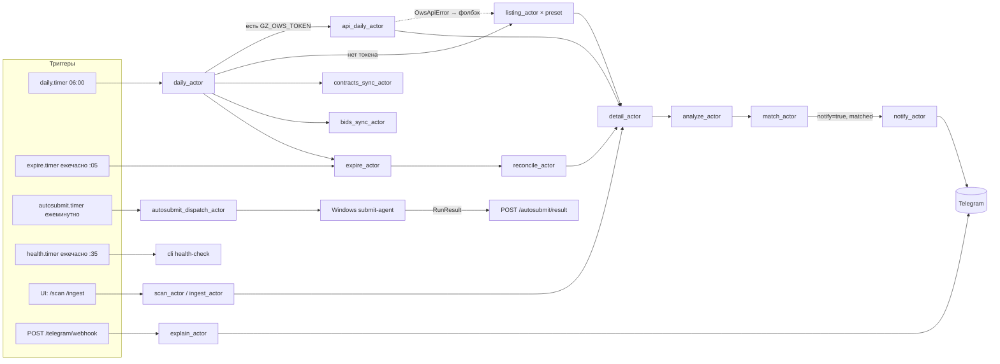
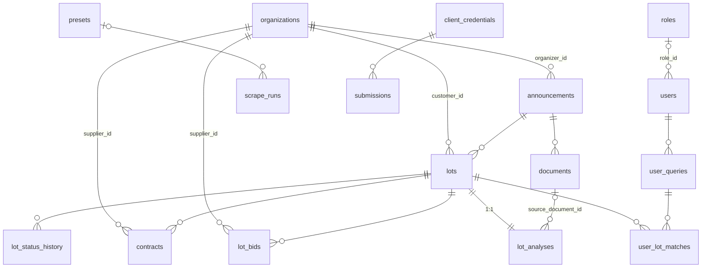

# Карта проекта

Обзорная карта: фичи и связи между ними, конвейер данных, модель БД,
веб-слой и матрица возможностей OWS API. Документ отвечает на вопрос
«что где и как связано»; ответы на вопрос «почему именно так» живут в
CLAUDE.md (архитектурные правила #1–#22) — здесь на них только ссылки
вида «правило #N». При добавлении актора, таблицы или фичи — обновить
соответствующий раздел здесь.

Снимок соответствует коду на 2026-07-27.

## 1. Карта фич

Ключевые зависимости между фичами:

- **Матчинг зависит от анализа**: `match_actor` работает по
  `LotAnalysis.tz_summary`, не по PDF. Нет анализа — лот невидим для
  семантического подбора.
- **Уведомления зависят от направления потока**: Telegram шлётся только на
  forward-потоке (новый анализ → матч), backfill молчит (правило #18).
- **Автоподача зависит от инжеста**: `open_at` подачи берётся из
  `Announcement.application_start`, который приезжает из `TrdBuy.startDate`
  (API) или парсится из HTML.
- **Ретроспектива цен зависит от дедлайна**: заявки видны в API только
  после окончания приёма (правило #22), поэтому `bids_sync` идёт от своих
  объявлений с прошедшим дедлайном, а не по окну дат.
- **Scope пронизывает чтение и fan-out**: `scope.py` используется и
  веб-слоем (фильтры выборок, гейт карточки), и матчингом (pre-filter до
  постановки в очередь).

## 2. Конвейер данных

### Схема акторов

### Очереди и акторы

Все очереди должны быть перечислены в `--queues` воркера
(`scripts/systemd/goszakup-worker.service`) — новая очередь без записи в
юните молча копит задачи в Redis.

| Очередь | Акторы | Назначение |
|---|---|---|
| `goszakup_daily` | `daily_actor`, `api_daily_actor`, `contracts_sync_actor`, `bids_sync_actor`, `expire_actor`, `reconcile_actor` | оркестрация ежедневного цикла и служебные синки |
| `goszakup_listing` | `listing_actor`, `ingest_actor`, `scan_actor` | обход выдачи (preset / БИН / ad-hoc форма) |
| `goszakup_detail` | `detail_actor` | одно объявление: детали, договоры, документы |
| `goszakup_llm` | `analyze_actor` | LLM-анализ одного лота |
| `goszakup_matching` | `match_actor` | матч пары (запрос × лот) |
| `goszakup_notify` | `notify_actor`, `explain_actor` | Telegram: уведомление о матче, объяснение лота |
| `goszakup_autosubmit` | `autosubmit_dispatch_actor` | диспетчер задач Windows submit-agent'у |

Закрытие `ScrapeRun` — двухконтурное: Redis-счётчик
`goszakup:run:<id>:pending` (DECR в `detail_actor`, ноль = закрыть) плюс
БД-heartbeat `last_progress_at` с reaper'ом `close_stale_runs`
(15 минут тишины; правило #14).

Синхронный путь мимо очереди: `cli run-preset`, `run-once`, `reanalyze`,
`daily --sync` — работают в своём процессе, Dramatiq не нужен.

### Триггеры (systemd)

| Юнит | Расписание | Делает |
|---|---|---|
| `goszakup-daily.timer` | 06:00 ежедневно | `cli daily` → `daily_actor` |
| `goszakup-expire.timer` | ежечасно :05 | `cli expire` → `expire_actor` (+ reaper, retention, reconcile) |
| `goszakup-health.timer` | ежечасно :35 | `cli health-check` (сторож LLM/OWS, правило #20) |
| `goszakup-autosubmit.timer` | ежеминутно | `cli autosubmit-dispatch --enqueue` |
| `goszakup-backup.timer` | 07:00 ежедневно | бэкап SQLite (`scripts/backup_sqlite`) |

## 3. Модель данных (16 таблиц)

Группы:

- **Ядро закупок**: `organizations` (одно лицо во всех ролях — заказчик /
  организатор / поставщик), `announcements` (PK = anno_id с сайта),
  `lots` (PK = lot_id, центральная таблица), `lot_status_history`,
  `documents` (sha256 + simhash для дедупа шаблонных ТЗ), `contracts`
  (уникальность `(lot_id, contract_number)` — два писателя: HTML detail и
  API-синк), `lot_bids` (PK = `TrdAppLots.id` из API — пересинк
  обновляет, а не дублирует; правило #22).
- **LLM**: `lot_analyses` (1:1 к лоту; два FK на `lots` — свой и
  `reused_from_lot_id` при дедупе по simhash), `llm_calls` (учёт расходов;
  **намеренно без FK** — лог переживает удаление сущностей и dev-админа
  uid=0).
- **Пользователи и подбор**: `users` (scope-поля — фильтр на чтение,
  правило #15; с лотами FK нет), `roles` (видимость вкладок UI для
  не-админов; `users.role_id`, NULL = все вкладки; реестр ключей —
  `web/pages.py`), `user_queries` (`version` инвалидирует
  кеш), `user_lot_matches` (кеш матчей, `notified_at` — дедуп
  уведомлений).
- **Операционные**: `presets`, `scrape_runs` (счётчики + heartbeat).
- **Автоподача**: `client_credentials` (секреты AES-256-GCM),
  `submissions` (статус-машина PLANNED → … → CONFIRMED; цена в `bid_enc`
  шифрованная — sealed-bid; `anno_id` — мягкая ссылка без FK).

## 4. Веб-слой

46 роутов в `web/app.py`; авторизация — cookie-сессия, зависимости
`require_user` / `require_admin` (правило #16) + `require_page(key)`
(вкладки по роли пользователя, `web/pages.py`), scope фильтрует чтение
(правило #15).

| Группа | Роуты | Роль |
|---|---|---|
| Листинги | `/` (дашборд), `/actual`, `/past`, `/starred`, `/matched` | user |
| Карточка лота | `/lot/{id}` + POST `chat`, `star`; `/document/{id}/download` | user |
| Действия с goszakup | POST `/lot/{id}/analyze`, `/lot/{id}/fetch_documents` (правило #9) | admin |
| Организации | `/organizations`, `/organization/{id}`; `/organization/{id}/report` (admin) | user/admin |
| Поставщики | `/suppliers` (+`?format=csv`) — кто выигрывает/проигрывает по ЕНС ТРУ, контакты для лидогенерации (правило #23) | admin |
| Семантические запросы | `/queries` + CRUD/rematch/toggle (чужой запрос → 404) | user |
| Прогоны и ad-hoc | `/runs`, `/runs/{id}`, `/scan`, `/presets`, `/expenses` (admin); `/ingest` — admin или роль с ключом `ingest` | admin/роль |
| Автоподача | `/submissions` (admin); `POST /autosubmit/result` — машинный токен `X-Autosubmit-Token` | admin/машина |
| Telegram | `POST /telegram/webhook` — машинный секрет заголовка | машина |
| Auth и профиль | `/login`, `/logout`, `/settings` (+test), `/users` CRUD (admin), `/roles` CRUD (admin — видимость вкладок для не-админов) | публичный/user/admin |

## 5. Источники данных и матрица OWS

Пайплайн ходит только через `sources.make_source()` (правило #21):
`ApiSource` (OWS, Bearer-токен) с фолбэком на `HtmlSource`
(ThrottledSession, Crawl-delay 5s, KZ-туннель). Каждый уход на фолбэк —
WARNING + Redis-флаг `goszakup:api_degraded`, который видит health-check.

### GraphQL-корни (18, доступ по токену проверен 2026-07-27)

| Корень | Статус | Сейчас / потенциал |
|---|---|---|
| `Lots` | ✅ используем | листинг + инкрементальный daily по `lastUpdateDate` |
| `TrdBuy` | ✅ используем | детали объявления, файлы, `startDate`/`endDate` приёма заявок |
| `Contract` + `ContractUnits` | ✅ используем | договоры и победители, включая закрытые лоты |
| `TrdApp` + `AppLots` | ✅ используем | заявки поставщиков с ценами после дедлайна (правило #22) |
| `Plans` | ⚙️ частично | сейчас — только код ЕНС ТРУ. **Потенциал: раннее предупреждение** — пункт годового плана публикуется за недели/месяцы до объявления; для автоподачи это знание о тендере до старта гонки |
| `Subjects` | ⚙️ частично | контакты поставщиков (email/телефон/сайт/адрес) для `/suppliers` — `jobs/supplier_contacts.py` (правило #23). Потенциал: резолв БИН по имени, склейка дублей customer-без-БИН (known issue #1 README) |
| `Rnu` | ❌ | реестр недобросовестных: флаг на карточке организации, проверка конкурентов |
| `qualifiedSuppliers` | ❌ | ландшафт конкурентов по нашим категориям |
| `ComplaintAppeal` | ❌ | жалобы/апелляции по объявлению — сигнал риска задержки или отмены итогов |
| `Acts` | ❌ | электронные акты — фактическое исполнение договора |
| `ContractWaybill*` | ❌ | накладные — детализация исполнения |
| `News` | ❌ | малоценно |
| `ObTrdBuy` / `ObLots` / `ObContract` / `ObPlans` | ❌ | модуль «Конкурс и аукцион» (system_id=2). Проверить, не живёт ли там часть конкурсов, невидимых через v3-корни |

### REST-эндпоинты v3 сверх GraphQL (по `docs/ows/ows_v3.md`)

Используем только справочники (`/v3/refs/ref_contract_status`).
Не используем, но доступно:

- **платежи по договорам** (полный реестр и по договору) — «заказчик
  реально платит» для отчёта по организации;
- **приостановление объявления** и **отмена закупки по решению суда** —
  события риска для отслеживаемых и запланированных к подаче лотов;
- **конкурсная комиссия** по объявлению;
- **адреса и сотрудники компаний**, реестр заказчиков — обогащение
  `organizations`;
- **заявки на включение в РНУ** (расширенный реестр) — ранний сигнал до
  попадания поставщика в РНУ.

Особенности фильтров API (проверено вживую) — `docs/ows/README.md`;
recon-факты клиента — `tests/fixtures/api/NOTES.md`.

## 6. CLI (основное)

| Команда | Что делает |
|---|---|
| `daily [--sync]` | ежедневный цикл (enqueue `daily_actor`) |
| `run-preset` / `run-once` | синхронный прогон мимо очереди |
| `contracts-sync`, `bids-sync`, `expire` | ручные синки (enqueue, `--sync` — в процессе) |
| `supplier-contacts-sync` | контакты поставщиков из реестра участников OWS (всегда в процессе) |
| `reanalyze` | LLM-бэкофилл по скачанным лотам |
| `match-backfill` | пересчёт матчей запроса |
| `health-check` | сторож LLM/OWS, exit 1 при проблеме |
| `create-user`, `list-users`, `set-password` | учётки |
| `telegram-set-webhook` | регистрация вебхука кнопки «Подробнее» |
| `create-credential`, `plan-submission`, `autosubmit-dispatch` | автоподача (дефолт `autosubmit-dispatch` — `--sync`, юнит передаёт `--enqueue`) |
| `init`, `seed-presets`, `presets`, `stats`, `queries` | сервисные |

## 7. Наблюдаемость и самолечение

- **health-check** (правило #20): живой пинг Cerebras, давность матчей,
  флаг `goszakup:api_degraded`, срок жизни OWS-токена. Алерт админам в
  Telegram с Redis-дедупом.
- **Reaper прогонов** (правило #14): heartbeat `last_progress_at` +
  `close_stale_runs` при 15 минутах тишины — страховка от потери
  Redis-счётчика (goszakup-redis непёрсистентный).
- **reconcile_actor**: находит объявления-заглушки (stub без деталей при
  актуальных лотах) и дозаказывает `detail_actor`.
- **retention**: `cleanup_old_documents` в цикле `expire_actor`.
- **Учёт LLM-расходов**: каждая реальная генерация пишется в `llm_calls`
  (analyze / match / chat / explain), отчёт — `/expenses`.
